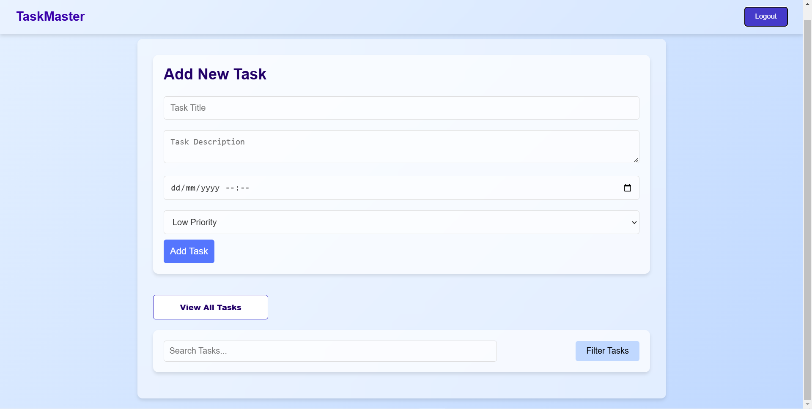
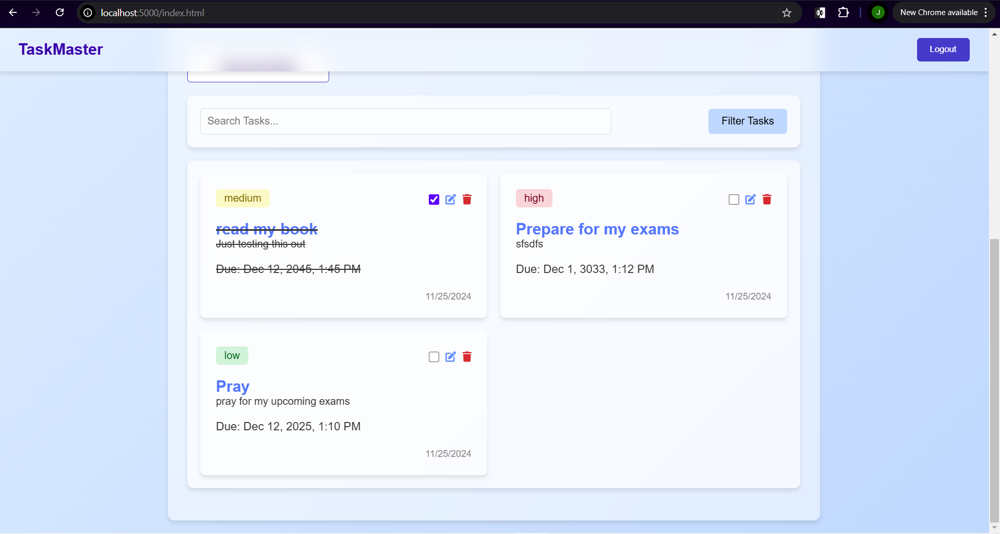
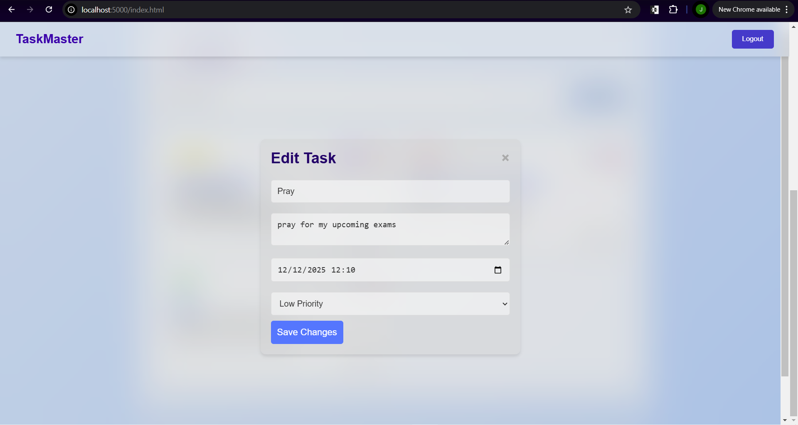

# TaskMaster - Task Management Application

**TaskMaster** is a full-stack task management system designed to help users create, organize, and manage tasks efficiently. The app features user authentication, task prioritization, search and filter functionalities, and CRUD operations. Built using modern technologies, TaskMaster aims to streamline productivity and enhance task management.

---

## 🚀 Features

### User Features

- **User Authentication**: Secure registration and login using JSON Web Tokens (JWT).
- **Task Management**:
  - Create, update, and delete tasks.
  - Organize tasks by priority (low, medium, high) and due dates.
- **Search & Filter**:
  - Search tasks by title or description.
  - Filter tasks by priority or due date.
- **Responsive UI**:
  - View tasks directly from the homepage.
  - Edit task details using a prefilled form modal.

---

## 🛠️ Tech Stack

### Frontend

- **HTML5** & **CSS3**: Responsive and user-friendly design.
- **JavaScript (ES6)**: Dynamic rendering and interaction.

### Backend

- **Node.js**: Server-side logic and API handling.
- **Express.js**: RESTful API creation.
- **MongoDB**: Database for storing user and task data.

### Other Tools

- **bcrypt**: Password hashing for secure user authentication.
- **jsonwebtoken**: JWT implementation for user sessions.
- **Font Awesome**: Icons for a visually appealing UI.
- **Fetch API**: For seamless communication between frontend and backend.

---

## 📂 Project Structure

```plaintext
Capstone-project/
├── data/                 # Database seed files or backups
├── frontend/             # Frontend files
│   ├── __tests__/        # Test files
│   ├── app.js            # Main frontend JavaScript logic
│   ├── index.html        # Main homepage
│   ├── login.html        # User login page
│   ├── register.html     # User registration page
│   ├── styles.css        # Main styling
│   ├── index.css         # Additional styling
├── models/               # Mongoose schemas
│   ├── Task.js           # Task model
│   ├── User.js           # User model
├── node_modules/         # Node dependencies
├── routes/               # API routes
│   ├── userRoutes.js     # Routes for user authentication
│   ├── taskRoutes.js     # Routes for task CRUD operations
├── .env                  # Environment variables
├── package.json          # NPM dependencies
├── package-lock.json     # Lockfile for        installed dependencies
├── README.md             # Project documentation

```

## 🗂️ API Endpoints

### User Routes

| **Method** | **Endpoint**          | **Description**             |
|------------|-----------------------|-----------------------------|
| `POST`     | `/api/users/register` | Register a new user         |
| `POST`     | `/api/users/login`    | Authenticate and get a JWT  |

### Task Routes

| **Method** | **Endpoint**          | **Description**             |
|------------|-----------------------|-----------------------------|
| `GET`      | `/api/tasks`          | Fetch all tasks for a user  |
| `POST`     | `/api/tasks`          | Create a new task           |
| `PUT`      | `/api/tasks/:id`      | Update a task by ID         |
| `DELETE`   | `/api/tasks/:id`      | Delete a task by ID         |

## 🖼️ Screenshots




